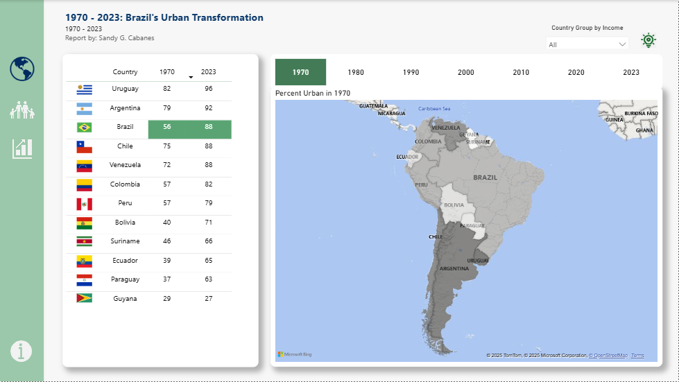
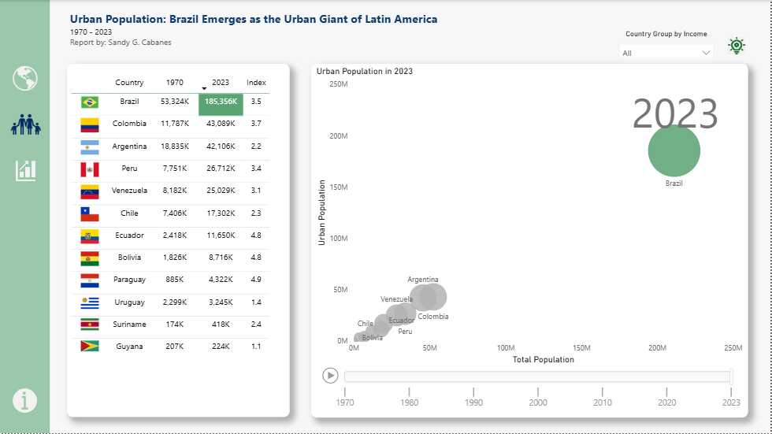
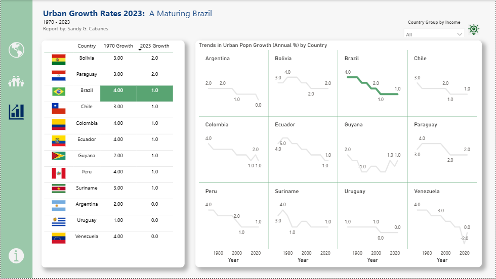
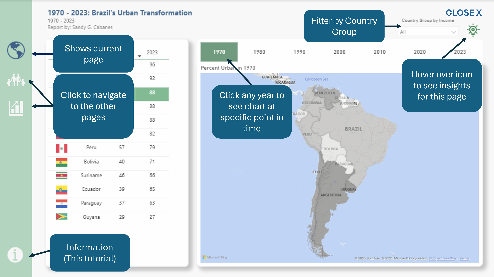

# Power BI Storytelling - The Urbanization of Latin America, Focus on Brazil
Urban Brazil: Underdog to Powerhouse

This is the story of the rise of Brazil as the Urban Giant that it is today in Latin America. 
This covers:
1. Where they started (historical context)
2. What happened (the dramatic rise)
3. Where they are now (current state)

Narrative:
1. 1970-2023: Brazil's Urban Transformation.  In 1970, Brazil lagged significantly behind leaders like Chile.  But Brazil went through a dramatic urban shift.
2. Urban Population: Brazil Emerges as the Urban Giant of Latin America.  Not only has it caught up with Chile in terms of urban percentage, it outpaced other countries in the region as well.  You may see this in the scatterplot.
3. Urban Growth Rates 2023: A Maturing Brazil.  Now Brazil has stabilized to 1% urban growth, similar to other countries.  While Bolivia and Paraguay manage to maintain growth at 2%.

## Screenshots of the dashboard

